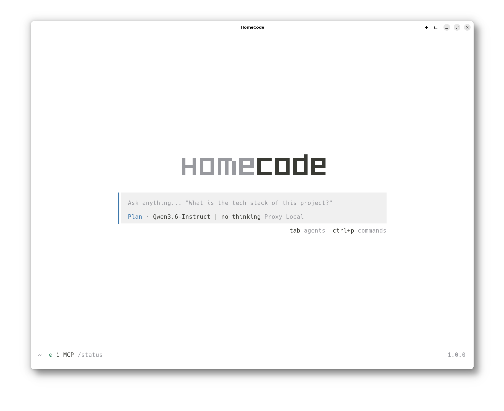

<p align="center">
  <a href="https://homecode.ai">
    <picture>
      <source srcset="packages/console/app/src/asset/logo-ornate-dark.svg" media="(prefers-color-scheme: dark)">
      <source srcset="packages/console/app/src/asset/logo-ornate-light.svg" media="(prefers-color-scheme: light)">
      
    </picture>
  </a>
</p>
<p align="center">The open source AI coding agent, redezined for local LLMs.</p>
<p align="center">
  <a href="https://www.npmjs.com/package/homecode-ai"></a>
  <a href="https://github.com/anomalyco/homecode/actions/workflows/publish.yml"></a>
</p>



---

> [!IMPORTANT]
> This is a fork of [Opencode](https://github.com/AnomalyCo/opencode), it is not affiliated with any of the original project's creators or contributors.

### Installation

HomeCode is currently under active development and needs to be built from source.

```bash
git clone https://github.com/AlexanderKyng/homecode.git
cd homecode/packages/homecode
OPENCODE_VERSION=1.0.0 OPENCODE_CHANNEL=latest bun run build
```

NPM and Homebrew installation methods will be added once the project stabilizes.

> [!NOTE]
> HomeCode is still in early development. Bugs may occur, and the full benefits of the optimizations are not yet fully realized. Expect frequent updates.

### What Makes HomeCode Different

HomeCode is a fork of [Opencode](https://github.com/AnomalyCo/opencode) redesigned from the ground up for local LLM workflows.

| Feature                     | Description                                                                                                                                                   |
| --------------------------- | ------------------------------------------------------------------------------------------------------------------------------------------------------------- |
| **Hash-Based Editing**      | Read, Edit, Write, and apply_patch use a line-level hash system, modifying only the lines that change instead of rewriting entire files                       |
| **Unique Tools**            | GitHub (remote repo inspection), CodeSearch (developer knowledge search), and MemPalace (persistent local memory) are not available in Opencode               |
| **All New Python Tool**     | An original, made from scratch, Python tool built with security and speed in mind. Enables your model to perform quick operations, calculations, you name it. |
| **Toon Compression**        | Tool outputs are compressed via Toon to reduce token usage and verbosity                                                                                      |
| **Local SearXNG**           | WebSearch and CodeSearch run through a local SearXNG instance (Docker deployment required) for privacy and self-hosted control                                |
| **Zero Telemetry**          | All tracking and telemetry is fully suppressed for complete privacy                                                                                           |
| **Optimized System Prompt** | Revamped tool explanations and system prompt that use fewer tokens while increasing LLM capability                                                            |
| **Vitesse Theme**           | Personalized terminal theme based on the Vitesse VS Code theme                                                                                                |

### Targeted Models

HomeCode is optimized for mid-sized local models that benefit most from reduced token overhead:

- **Qwen 3.5 / 3.6 27B and 35B-A3B**

The optimizations provide significant benefits for many other local LLMs ranging from 8 to 80B parameters.

### Roadmap

Upcoming work includes, but is not limited to:

- **Memory Tool** — Purpose-built memory system designed for local LLM workflows
- **ZED IDE Integration** — Native integration with the ZED editor
- **Revamped Hashing** — Improved hashing method to resolve current edge-case bugs
- **Prompt & Tool Alignment** — Further refinement of system prompts and tool definitions for better LLM alignment

### Contributing

HomeCode is in active development. If you'd like to contribute, feel free to open issues or submit pull requests. For questions and discussion, use the [GitHub discussions](https://github.com/AlexanderKyng/homecode/discussions) or [issues](https://github.com/AlexanderKyng/homecode/issues) page.
